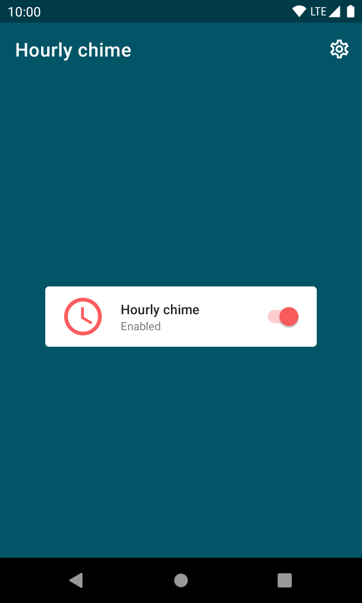
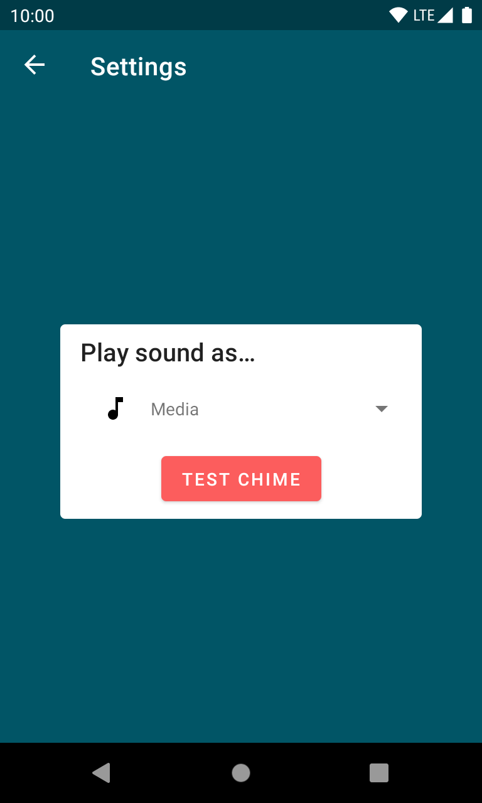
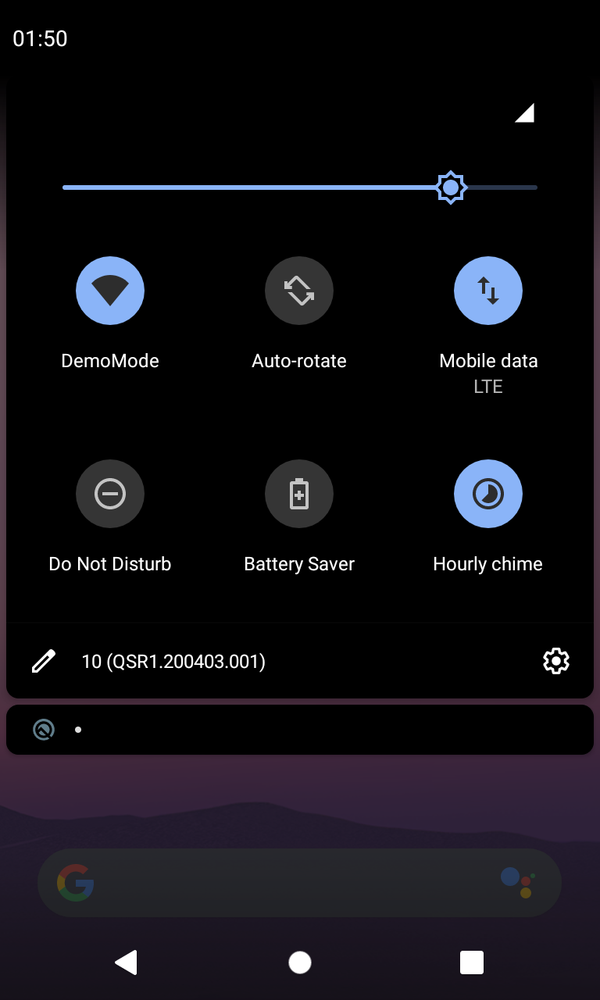
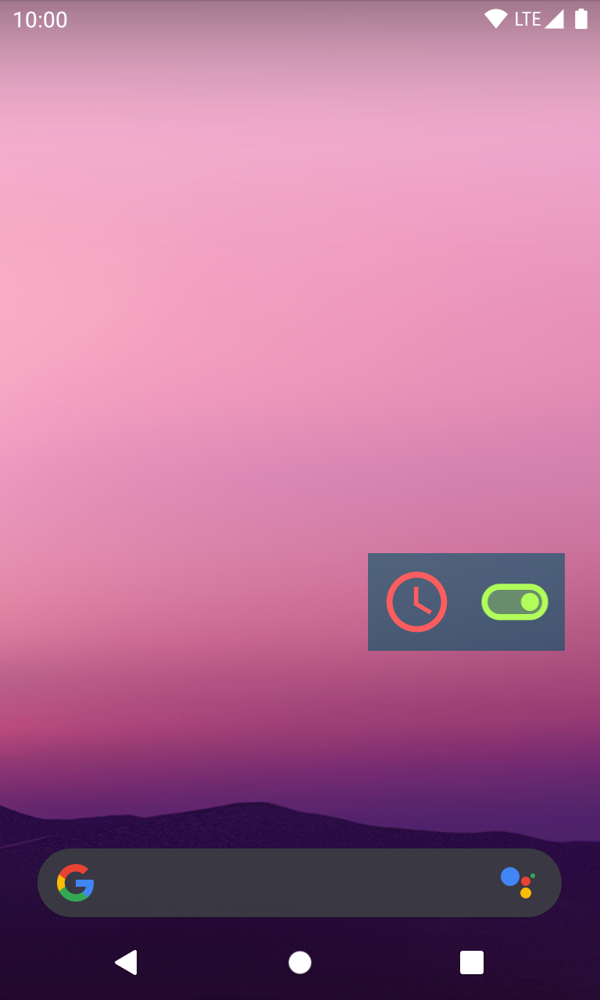

# About

*This project is part of a series of small and quick projects created to have some code references for future creations. Be aware, these projects are not focused on best practices, testing or code quality in general, their purpose is to be the first steps to a more solid implementation.*

"Hourly Chime" is an Android application that makes a sound every hour. Yes, that's it.

## What does this project use

What can this project offer as a reference for the future?

- [x] Simple widget
- [x] Quick Settings tile

## How to run

Open the project in AndroidStudio and run the application.

## Screenshots

